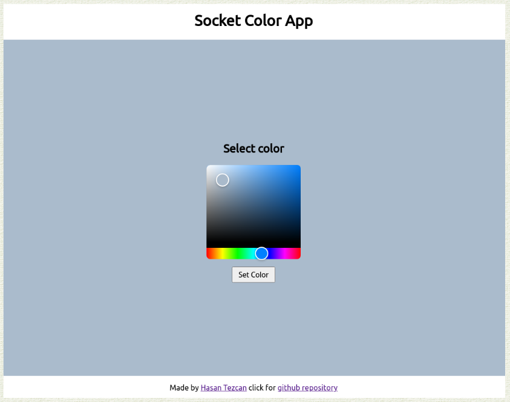

### `Kodluyoruz Earlybird Front-End Talent Bootcamp`

## Ödev 4 - `Hasan Tezcan`

**Bootcamp boyunca aldığım tüm notlar:** https://github.com/hasantezcan/kodluyoruz-react-bootcamp

---

### **Önizleme:** 
- https://kodluyoruz-odev-4-realtime-colors.netlify.app/  
    

### **Ekran görüntüsü:**

## Kullanılan Paketler 
- [react-colorful](https://github.com/omgovich/react-colorful)
- [color-convert](https://www.npmjs.com/package/color-convert)
- [animate-css](https://github.com/digital-flowers/react-animated-css)

---

### Görev:
[Socket.IO](https://socket.io/) ve React ile çalışan bir uygulama geliştirmeniz bekleniyor. Yapacağınız uygulamanın bitmiş halini aşağıdaki videodan görüntüleyebilirsiniz.

## Gereksinimler

- [x] Kullanıcı herhangi renk seçip, butona bastığı anda bağlı olan tüm client'larda seçilen renk gösterilmelidir.
- [x] Seçilmiş olan rengin hex kodunu yine bağlı olan tüm clientlarda görebilmeliyiz. (Örnek videoda yok)
- [x] Renk değiştirilip sayfa yenilendikten sonra seçilen en son renk hangisiyse onu görmeliyiz.
- [x] Backend'i deploy etmek için [Heroku](heroku.com) veya herhangi başka bir sağlayıcı kullanılabilir.
- [ ] Sayfa ilk açıldığında kullanıcıdan bir isim alınır. Renk değiştirildiği anda bağlı olan tüm clientlarda rengi değiştiren kişinin ismi görünür. (Bonus madde, zorunlu değil)
- [x] Uygulamanın çalışır hali Netlify üzerine deploy edilmeli ve README dosyasının en üst satırına önizleme bağlantısı eklenmelidir.

